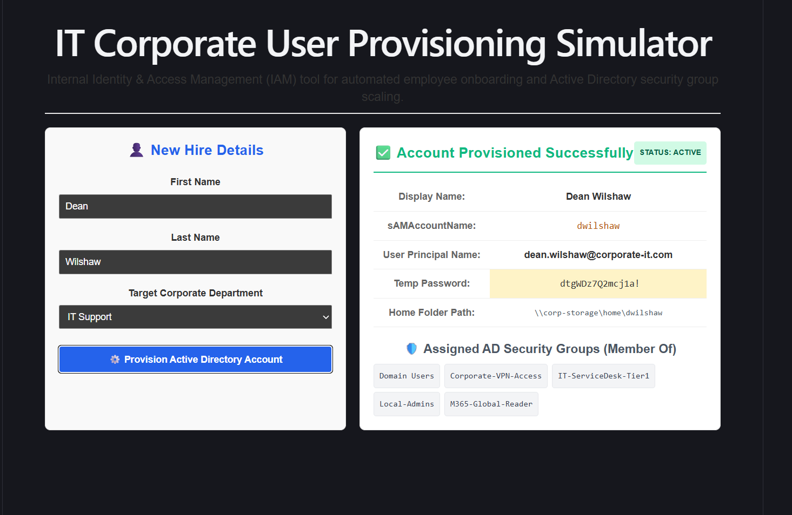

# IT Corporate User Provisioning Simulator

A specialized Identity and Access Management (IAM) automation script utility designed to simulate employee account onboarding, automated enterprise email standardization, corporate directory path mapping, and role-based Active Directory (AD) security group allocation.

### Frontend Architecture & IAM Logic

The simulator is a Vite React frontend that keeps the provisioning workflow client-side for safe portfolio demonstration. The UI captures new-hire details, processes them through deterministic IAM rules, and renders the generated account profile immediately.

- **Username generation:** First and last names are trimmed, lowercased, and sanitized with `/[^a-z0-9]/g` to remove symbols before producing a `sAMAccountName` pattern such as `jdoe`.
- **UPN/email standardization:** Sanitized names are combined into the corporate identity format `firstname.lastname@corporate-it.com`.
- **Active Directory group mapping:** The selected department maps to a base access set plus department-specific security groups, such as `IT-ServiceDesk-Tier1`, `Finance-SAGE-Access`, `HR-Personnel-Records`, or `Warehouse-WMS-Cloud`.
- **Temporary credential flow:** The app generates a temporary password from a controlled character pool and appends complexity characters so the output resembles enterprise onboarding credentials.
- **Home directory rule:** Provisioned users receive a simulated network home path in the format `\\corp-storage\home\username`.

## Key Features
* **Standardized Identity Generation Logic:** Converts raw text strings into strict, corporate-compliant sAMAccountName patterns (e.g., `dsmith`) and User Principal Names (UPN email patterns like `john.smith@corporate-it.com`).
* **Algorithmic Input Sanitization:** Leverages RegEx string manipulation blocks to completely strip trailing whitespaces, symbols, and irregular special characters from inputs, guaranteeing database integrity.
* **Role-Based Security Scaling:** Simulates automated department mapping, instantly dropping provisioned profiles into their corresponding enterprise security groups (e.g., mapping an Operations starter into `Warehouse-WMS-Cloud` and `Inventory-Audit-Users`).
* **Temporary Credential Engineering:** Utilizes index-swapping loop generation algorithms to output complex, 15-character temporary passwords matching standard corporate administrative complexity profiles.

---

## 🛠️ Troubleshooting & Core Resolutions

During the engineering, data mapping, and algorithmic construction of this IAM engine, two standard structural logic and interface state blocks were resolved:

### 1. Special Character Account Name Fragmentation
* **Problem:** Entering names containing hyphens, apostrophes, or accidental symbols (e.g., "O'Connor" or "Jane-Doe") passed directly into the email and username generator, which would break actual Active Directory syntax policies and email server configurations.
* **Resolution:** Implemented an input purification pipeline utilizing JavaScript RegEx filtering logic (`.replace(/[^a-z0-9]/g, '')`). This automatically strips non-alphanumeric elements, forcing usernames and email addresses to compress into compliant, machine-readable syntax frames while preserving the full display name.

### 2. State Mapping Interface Desynchronization
* **Problem:** Modifying the target department dropdown selection did not dynamically update the underlying Active Directory security group preview container, leading to stale configuration views.
* **Resolution:** Isolated as a standard state-hook synchronization gap. Re-engineered the layout array mapping to process the conditional evaluation method directly inside the core state change cycle. This bound the visual security badge outputs directly to the reactive user choice array, resulting in immediate UI synchronization when toggling departments.
